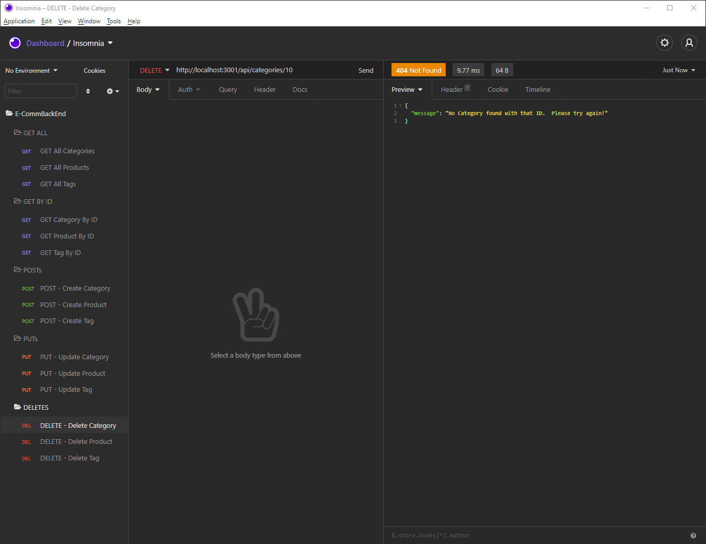

# **Object-Relational Mapping (ORM): E-Commerce Back End**

## **Description**

Your task is to build the back end for an e-commerce site by modifying starter code. You’ll configure a working Express.js API to use Sequelize to interact with a MySQL database.

## Table of Contents

- [User Story](#user-story)
- [Acceptance Criteria](#acceptance-criteria)
- [Installation](#installation)
- [Usage](#usage)
- [Required](#required)
- [Testing](#testing)
- [Questions And Support](#questions-and-support)
- [Contributors](#contributors)
- [Deployed Link](#deployed-link)
- [Media Links](#media-links)
- [License](#license)

---

## **User** **Story**

AS A manager at an internet retail company I WANT a back end for my e-commerce website that uses the latest technologies SO THAT my company can compete with other e-commerce companies

## **Acceptance** **Criteria**

GIVEN a functional Express.js API WHEN I add my database name, MySQL username, and MySQL password to an environment variable file THEN I am able to connect to a database using Sequelize WHEN I enter schema and seed commands THEN a development database is created and is seeded with test data WHEN I enter the command to invoke the application THEN my server is started and the Sequelize models are synced to the MySQL database WHEN I open API GET routes in Insomnia Core for categories, products, or tags THEN the data for each of these routes is displayed in a formatted JSON WHEN I test API POST, PUT, and DELETE routes in Insomnia Core THEN I am able to successfully create, update, and delete data in my database

## **Installation**

- Steps to install + Install Node.js + Clone repository to your local machine + Run "npm install" to install all dependencies + Open MYSQL workbench and execute the schema + Type "node seeds/index.js" on the root to seed the tables + Type "node server.js" on the root to run the application

## **Usage**

- Directions: + Once the application is running, open Insomnia at localhost:3001/api/ + To View All products: localhost:3001/api/products + To View All categories: localhost:3001/api/categories + To View All tags: localhost:3001/api/tags + To View All products: localhost:3001/api/products + To view by ID, add an ID to the end of the "View All" route + To create a new item use POST + To Update an item use PUT + To remove an item use DELETE.

## **Media** **Links**

## Show All

## Update

## Delete Error Message

!

## Full Demo video links:

Link1: Shows View(Get) All Categories, Products and Tags. View(GET) Category, Product and Tag by ID. Create New Category, Product and Tag: 
https://drive.google.com/file/d/1Y65BGXCjEACWaTeJ6sUOVwFr6w1abDNC/view?usp=sharing

Link2: Shows Updates and Deletes for Categories, Products and Tags: 
https://drive.google.com/file/d/1kd7Ncj7WUWcAaNIV0wL74uAyfYJp16Uj/view?usp=sharing

## **Required**

- The following node modules are required: + express + mysql2 + sequalize + dotenv

## **Testing**

Each function was executed and tested

## **Questions** **And** **Support**

If you have any questions about the application or the repository, please open an [issue](https://github.com/pmarceaujr/Mock_E-CommBackEnd/issues) or contact me via email at paul@marceaus.net.  
 You can find more of my work on my [GitHub](https://github.com/pmarceaujr).

## **Contributors**

No other contributors at this time

## **Deployed** **Link**

No web deployment link for this app

## **License**

This project is licensed under the [MIT License](https://choosealicense.com/licenses/mit).
